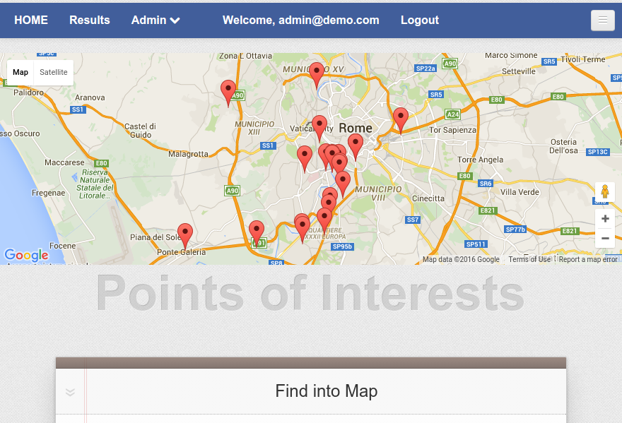
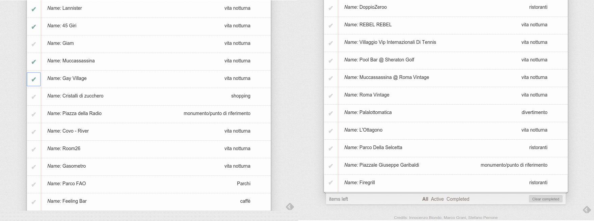

# Profilazione dell'utente e predizione dei punti di interesse estratti dalle reti sociali
==========================================================================================

## Introduzione
---------------
Costruire un DataSet recuperando i dati di utenti e punti di interessi dalle reti sociali Instagram e Foursquare; successivamente vengono utilizzati degli algoritmi per elaborare i dati. Il nostro DataSet principalmente ci offre un insieme di dati che riguardano punti di interessi vari (es bar,ristorante,ecc) e per ognuno di essi viene fatto corrispondere un set di foto che i diversi utenti hanno pubblicato su Instagram in quel punto di interesse. Vengono utilizzati questi dati per costruire una timeline per ogni utente, ottenendo la storia dei punti di interesse che un utente ha visitato. Utilizzando la timeline di ogni utente applichiamo un algoritmo di clustering che permette di suddividere un insieme di utenti in k gruppi sulla base dei punti di interesse.
Nel DataSet applichiamo una  funzione di peso tf-idf (term frequency–inverse document frequency) e la coseno similarità. Vengono poi ricercati gli utenti più simili, confrontati e pesati i luoghi in cui l'utente prescelto non è andato ed infine restituiti i risultati tramite interfaccia grafica creata con angularjs

##Collections DataSet
-----------------------
* **venues**:  contiene i punti di interesse recuperati da foursquare per ottenere tutti i corrispondenti id instagram per identificare i luoghi.

* **mediarecentvenues**: ogni istanza contiene la foto di un utente che ha fatto il check-in in un certo luogo, con le relative proprietà (come per esempio utenti con le proprie informazioni, commenti,  likes e i tag della relativa foto ecc…)

* **mediarecentidmaxes**: contiene l'id max del punto di interesse per esplorare la timeline e recuperare foto meno recenti.

* **instagram_venues**: contiene tutti i precedenti luoghi recuperati con le rispettive proprietà (nome, latitudine, longitudine, id_foursquare).

* **instagram_venues2**: aggiunge al precedente DataSet la categoria di ogni singolo luogo

* **instagram_venues_macrocategory**: contiene la lista dei luoghi recuperati con associata anche la macrocategoria alla quale appartiene il punto di interesse

* **macrocategories**: definisce ogni categoria a quale macrocategoria appartiene e la lista dei luoghi sotto quella macrocategoria

* **usertimelines**: contiene la lista dei singoli utenti con i rispettivi luoghi visitati e il vettore pesato con il numero di volte che un utente è stato in un certo luogo appartenente a una certa macrocategoria

* **raccomendedcategories**: rappresenta l'utente cercato e la lista dei luoghi consigliati in base all'insieme dei posti visitati dagli utenti più simili

##Creazione DataSet
-------------------
Per la creazione del DataSet utilizziamo le API di Foursquare e di Instagram per recuperare i dati. Con le API di Foursquare riusciamo a ottenere dei punti di interesse di vari generi come monumenti, pizzerie , bar ecc.; una volta recuperati i dati utilizziamo le API di Instagram per ottenere l'id Instagram da quello di foursquare. Abbiamo fatto questa scelta di combinare i due social perchè in questo modo possiamo filtrare tutti i punti di interesse che per noi sono spam, dato che su instagram ogni utente, oltre a fare il check-in in punti di interesse pubblici, puo registrarsi in un nuovo luogo che crea al momento, come ad esempio "casa mia" o altro. Dopo aver ottenuto l'id di Instagram con lo script *retrivalIdInstagram* ci creiamo la collezione instagram_venues nel quale sono presenti dati come l'id instagram, quello foursquare, latitudine, longitudine e nome del posto. Ottenuti gli id di ogni punto di interesse andiamo a costruire la timeline di ogni luogo; questa rappresenta la collezione di foto che i vari utenti pubblicano facendo il check-in in quel punto di interesse. Tutti i dati relativi alle foto li salviamo in una collezione *mediarecentvenues* e con lo script *updateMediaRecent* andiamo ad aggiornare e salvare tutte le foto di ogni punto di interesse che sono state pubblicate meno recentemente, poichè nella fase precedente, le limitazioni delle Api ci permettevano solamente di recuperare le ultime foto pubblicate .
Nell'utilizzo delle API di Foursquare e Instagram abbiamo notato che ci sono molte restrizioni: in foursquare, la risposta della query che facciamo tramite le API per quanto riguarda la ricerca dei luoghi in una determinata area, era limitata; abbiamo ovviato al problema facendo più query con diverse coordinate e raggio minore, così da ricoprire l'intera area di Roma. Abbiamo modificato anche la libreria foursquarevenues nella quale mancava la gestione degli errori.

##Elaborazione dati
-------------------
Una volta costruito il DataSet abbiamo iniziato ad elaborare i dati creando una nuova collezione con *CreateCollectionUserTimeline* ; con questa, viene generata la cronologia delle foto che ogni utente ha pubblicato nei vari punti di interesse così da ottenere la lista dei luoghi in cui ognuno è stato.
Ottenuta l'intera lista di utenti e i rispettivi posti visitati, abbiamo deciso di categorizzare ogni singolo luogo, così da poter eliminare tutti quelli che risultavano di scarso interesse. Utilizzando lo script *instagramAddCategory*, abbiamo analizzato il DataSet venues per escludere tutti i luoghi nei quali non è presente la categoria e per aggiornare gli altri con la categoria alla quale appartengono.
Abbiamo poi deciso di raggruppare le diverse categorie in 8 differenti macrocategorie, definendo nello script *macrocategory* ogni categoria a quale macrocategoria dovesse appartenere. Questo inoltre è stato molto utile per filtrare ulteriormente i luoghi ottenuti, escludendo quelli dal basso interesse come "scuola" o luoghi personalizzati e creati dai singoli utenti. Le 8 macrocategorie definite sono state:"ristoranti","caffè", "vita notturna", "divertimento", "interessi culturali", "parchi", "shopping" e "monumento/punto di riferimento".
Lo script *InstaAddMacrocategory* ci ha permesso così di aggiornare il nostro DataSet aggiungendo alle informazioni precedenti, anche ogni singolo luogo a quale macrocategoria appartiene.
Abbiamo infine utilizzato gli script *insertnewfield*, *userTimeline* e *createVecUser*: il primo aggiunge, grazie al DataSet precedentemente creato, ad ogni utente un vettore di zeri di 8 elementi, ognuno per una macrocategoria specifica; il secondo invece, aggiunge la lista dei luoghi visitati da ogni utente; infine il terzo che aggiorna il vettore di zeri: ogni volta che trova un luogo di un certo tipo, incrementa il valore  che appartiene a una specifica macrocategoria. Così facendo, rappresentiamo per ogni elemento del vettore, quante volte l'utente è stato in un certo luogo appartenente ad certa macrocategoria.

##Predizione dei luoghi
-------------------
In questa fase sono stati selezionati vari utenti sui quali abbiamo effettuato delle prove per vedere se effettivamente in base ai loro interessi, venissero restituiti luoghi attinenti e che magari l'utente selezionato avesse potuto e voluto visitare.
Per prima cosa abbiamo selezionato un utente tra la lista di quelli presenti nel db; abbiamo così avviato lo script *kmeans* che in pratica recupera ogni utente dal DataSet usertimeline con il rispettivo vettore di macrocategorie e, utilizzando l'algoritmo kmeans, restituisce i vari cluster con i rispettivi utenti appartenenti a ogni cluster; in tutto vengono generati 128 cluster differenti, in modo che non vengano inseriti all'interno dello stesso cluster utenti troppo diversi tra loro. A questo punto viene ricercato l'utente che abbiamo scelto a quale gruppo appartiene, viene restituita la lista degli utenti dello stesso gruppo e si confrontano poi tutti gli utenti del cluster con l'utente stesso per calcolare la similarità con tutti i membri appartenenti al gruppo. Alla fine si ordinano poi i risultati in base al valore di similitudine ottenuto, dai più simili ai meno simili. Tutto questo è calcolato utilizzando il Tf-Idf con la coseno similarità.
Infine, vengono presi i primi 5 utenti più simili in ordine, vengono ricercati i loro id nel DataSet per recuperare i luoghi che hanno visitato e viene salvata in un file la lista degli utenti con i rispettivi luoghi in cui sono stati e la loro similarità con l'utente di confronto.
In un altro file viene inoltre salvato l'utente selezionato, con tutti i luoghi in cui è stato; questo ci permette di stabilire tramite un confronto tra i due file, in quali luoghi l'utente che deve essere consigliato è gia stato così da non riproporli. Si prendono poi tutti i luoghi in cui è stato ogni utente e si conta  quante volte appare ogni luogo; questo ci è utile per proporre prima i luoghi visitati più volte ed infine quelli meno visitati. Tutto questo viene salvato in un db ordinando i risultati in questo modo: per primi i luoghi in cui l'utente tra i 5 più simili è stato, ordinato dal più al meno visitato e poi lo stesso per gli altri 4 utenti. Abbiamo optato per questa soluzione così da non consigliare solo i luoghi più visitati in generale, ma per mettere tra i "primi" posti anche quelli meno famosi, ma comunque visitati dagli utenti più simili

##Interfaccia grafica e restituzione dei risultati
-------------------

L'interfaccia grafica è stata sviluppata partendo da un progetto che utilizza delle librerie tra le quali express e angoose (angularjs e mongoose) il tutto utilizzando il pattern architetturale Model-View-Controller (MVC).
Tutti i risultati ottenuti vengono visualizzati sia tramite una lista con i rispettivi nomi e categorie dei luoghi restituiti, sia tramite una mappa che utilizzando i dati di latitudine e longitudine che permette di visualizzare i rispettivi luoghi sulla mappa con dei marker contrassegnati dal nome del luogo di interesse. Alla fine prendendo il profilo di un utente che nella sua timeline ha fatto il check-in solamente nella categoria vita notturna il nostro sistema ci suggerisce i seguenti risultati:

------------------

------------------

##Test
-------------------
Sono inoltre stati effettuati vari test su utenti presi a caso appartenenti a specifici cluster differenti così da poter testare il sistema e il suo corretto funzionamento:
Esempi di utenti

**Utente** * 370295607
**Interessi**:"monumento/punto di riferimento" : 0,"shopping" : 0,"Parchi" : 5,"interessi culturali" : 0,"divertimento" : 0, "vita notturna" : 0,"caffè" : 0,"ristoranti" : 0;
**Similarità**: -219671101, similarity: 1, -557445642, similarity: 1, -384202905, similarity: 1, -1434160162, similarity: 1, -414515034, similarity: 1;
**Luoghi consigliati**:"Parchi" : Parco Lanciani, Villa Paganini, Parco Santa Maria della Pietà, Parco della Pace, Parco dei Martiri di Forte Bravetta, Floracult, Villa Carpegna;

**Utente** * 17563068
**Interessi**:"monumento/punto di riferimento" : 0,"shopping" : 1,"Parchi" : 0,"interessi culturali" : 0,"divertimento" : 0, "vita notturna" : 0,"caffè" : 0,"ristoranti" : 5;
**Similarità**: -1067736539, similarity: 1, -405112120, similarity: 1, -1504450751, similarity: 0.999, -214526777, similarity: 0.999, -204570, similarity: 0.992;
**Luoghi consigliati**:"Ristoranti" : Trapizzino, Creperia Michelangelo, Pizzarium, Ristorante Bar Alì Baba, Il Fico D'India, Los Cabos Tex Mex, Pietralata Pizzeria di Quartiere, Albaruja, Cripsy Amsterdam, Le Coq, Burger King, Alice Pizza Quattro venti, Xinyuan Nuova Fonte; "shopping": La Pasticceria di Montarsino, Pasticceria Siciliana, Eataly, Castroni, Faro del Giannicolo, Panificio new F.lli Carpiceti

**Utente** * 53734857
**Interessi**:"monumento/punto di riferimento" : 4,"shopping" : 16,"Parchi" : 1,"interessi culturali" : 0,"divertimento" : 0, "vita notturna" : 5,"caffè" : 0,"ristoranti" : 5;
**Similarità**: -1161891, similarity: 0.966, -37624290, similarity: 0.96, -47093786, similarity: 0.955, -29600511, similarity: 0.949, -1413022832, similarity: 0.942;
**Luoghi consigliati**:"Shopping": Selfie, Centro Commerciale Euroma2, Bakery House, Mamma che Pane, Studio 74 I Parrucchieri, Ibs.it Bookshop, Arion, Eataly; "Parchi": Villa Ada, Parco Giochi Torresina; "monumento/punto di riferimento": Piazza San Pietro, Piazza Clemente XI, via Indro Montanelli; "divertimento": Stadio Olimpico; "ristoranti": La Romanina, Anema e Cozze, Futurarte, Mamma Che Pizza, Xin Yuan; "vita notturna": Futurarte, Fiesta Tropical, Kino Village; "interessi culturali": Galaxy,WSP photography;

Qui sono riportati solo alcuni esempi per rappresentare i risultati

##Sviluppi futuri
-------------------
E' stato inserito nell'interfaccia grafica un login che può permettere, tramite ulteriori sviluppi, di identificare l'utente che fa il log e di restituire per quell'utente direttamente la lista dei luoghi consigliati. Inoltre, potrebbe essere possibile poter selezionare dalla lista il luogo al quale l'utente è interessato e mostrare oltre delle informazioni extra, anche il percorso da dove si trova l'utente in quel momento al punto di interesse selezionato
